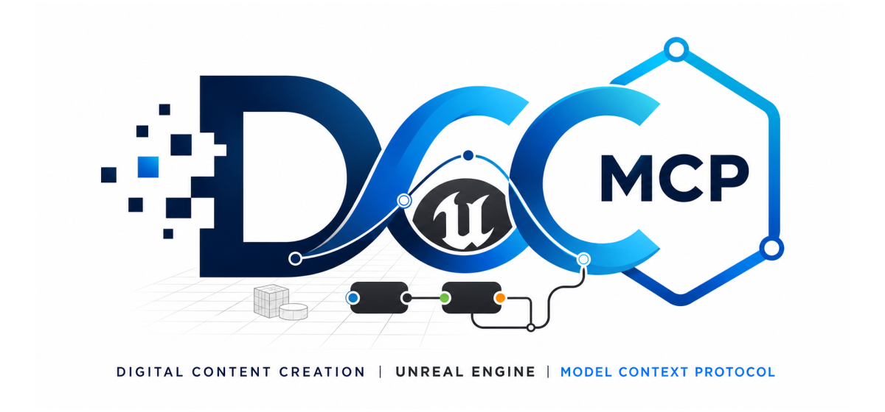

# dcc-mcp-unreal

<p align="center">
  
</p>

<!-- Badges -->
[](https://pypi.org/project/dcc-mcp-unreal/)
[](https://pypi.org/project/dcc-mcp-unreal/)
[](LICENSE)

Open-source Unreal Engine adapter for the **DCC Model Context Protocol (MCP)**
ecosystem. It connects Unreal through an embedded Python server or a native
standalone sidecar, both built on
[dcc-mcp-core](https://github.com/dcc-mcp/dcc-mcp-core).

MCP-compatible agents (Claude Desktop, Cursor, OpenClaw, …) can use typed tools
to inspect scenes, author assets and Blueprints, control cinematics and effects,
and validate results through PIE and Unreal Automation.

## Agent workflow

AI agents should use the shared gateway through `dcc-mcp-cli`; IDE users may
continue to use the MCP endpoint. Prefer typed skills and tools over raw scripts.

### Install or update the CLI

`dcc-mcp-cli` is the preferred control path for every shell-capable agent. If
it is missing, ask the user before installing the latest official release:

```bash
# Linux/macOS
curl -fsSL https://raw.githubusercontent.com/dcc-mcp/dcc-mcp-core/main/scripts/install-cli.sh | sh

# Windows PowerShell
powershell -ExecutionPolicy Bypass -c "irm https://raw.githubusercontent.com/dcc-mcp/dcc-mcp-core/main/scripts/install-cli.ps1 | iex"
```

Keep an official build current through the release manifest:

```bash
dcc-mcp-cli update check
dcc-mcp-cli update apply
```

`update apply` downloads and stages the latest CLI for the next launch. It
does not update a running `dcc-mcp-server`; update that server in its own
environment.

```bash
dcc-mcp-cli dcc-types
dcc-mcp-cli list
dcc-mcp-cli search --query "<task>" --dcc-type unreal
dcc-mcp-cli describe <tool-slug>
dcc-mcp-cli call <tool-slug> --json '{"key":"value"}'
```

`dcc-types` reports release-catalog support; `list` reports live sessions. If a
tool belongs to an inactive progressive skill, call `dcc-mcp-cli load-skill <skill-name> --dcc-type unreal` before retrying. For post-task improvement,
attach a stable session id with `--meta-json`, query `dcc-mcp-cli stats --range 24h --session-id <task-id>`, then pass the bounded evidence to the
`review_skill_improvement` prompt from `dcc-mcp-skills-creator`.

---

## Overview

`dcc-mcp-unreal` follows the same architecture as
[dcc-mcp-maya](https://github.com/dcc-mcp/dcc-mcp-maya):

```
Agent (Claude / Cursor)
    │  dcc-mcp-cli or MCP
    ▼
Shared gateway  →  Unreal MCP instance  ←  SkillCatalog
    │
    ▼
Embedded Python | native sidecar | optional Epic MCP bridge
    │
    ▼
Unreal main thread  →  Unreal Editor API / Toolset Registry
```

Each skill script is a standalone Python file that uses Unreal Engine's
`unreal` Python module. Scripts are discovered from `SKILL.md` plus sibling
`tools.yaml` metadata and exposed as MCP tools automatically.

---

## Why DCC MCP when Unreal already has an official MCP?

MCP is a protocol, not a complete automation product. It standardizes how an
AI client discovers context and invokes tools; it does not decide which editor
operations exist, how extensions are packaged, how multiple DCC instances are
discovered, or how tools are routed and operated safely. This separation is a
core part of [MCP's extensible architecture](https://modelcontextprotocol.io/specification/2025-11-25#architecture).

Epic's [Unreal MCP](https://dev.epicgames.com/documentation/unreal-engine/unreal-mcp-in-unreal-editor)
is valuable: it is an engine-native, experimental MCP server in Unreal Engine
5.8+, and its Toolset Registry lets teams add Python and C++ tools. DCC MCP is
not a competing wire protocol or a fork of that server. It is the broader,
open-source control and extension layer around Unreal and the rest of a DCC
pipeline.

| Capability | Epic Unreal MCP | DCC MCP Unreal |
| --- | --- | --- |
| Primary role | Expose one Unreal instance through MCP | Discover, extend, and operate Unreal through the shared DCC MCP ecosystem |
| Engine coverage | Experimental in Unreal Engine 5.8+ | Capability-gated support from Unreal Engine 4.18+, including Python and standalone sidecar paths |
| Extension model | Unreal Toolset Registry with Python or C++ toolsets | Portable `SKILL.md` + `tools.yaml` packages, built-in and external skill paths, plus the Epic Toolset Registry bridge |
| Discovery and routing | Clients connect to the editor's local endpoint | Progressive search/load/call, stable gateway routing, CLI access, and multiple live-instance discovery |
| Execution contract | Unreal-native tool schemas and game-thread execution | Typed schemas plus affinity, timeout, read-only, destructive, and idempotency metadata |
| Pipeline scope | Unreal Engine | The same gateway and skill contract across Unreal and other DCC adapters |

On Unreal Engine 5.8+, DCC MCP can discover and call the installed Epic
endpoint through the `unreal-official-mcp` skill while preserving Epic's tool
names and schemas. It does not copy or redistribute Epic's `NoRedist` plugin.
The resulting capability set is therefore:

> **DCC MCP native skills + optional Epic toolsets + shared gateway/CLI +
> cross-DCC integrations.**

That is why DCC MCP has a larger system-level capability surface. "Larger"
does not mean every DCC MCP tool is better than its engine-native equivalent;
it means you keep the official tools where they are strongest and gain the
version reach, extension packaging, routing, and pipeline composition around
them.

---

## Features

- **Skills-First workflow** — drop a `SKILL.md` + `scripts/` directory anywhere
  and it becomes MCP tools automatically
- **Zero boilerplate** — use `@skill_entry`, `unreal_success()`, `unreal_error()`
  helpers identical in spirit to `dcc-mcp-maya`'s `@with_maya`, `maya_success()`
- **Broad typed coverage** — actors, assets, Blueprints, levels, materials,
  cinematics, Niagara, MetaSound, Chaos, Fab, PIE, automation, and packaging
- **Cross-version runtime** — embedded Python where available and a native
  standalone sidecar for legacy or Pythonless engines
- **Progressive discovery** — search, load, and call only the skills needed for
  the task through the shared gateway and CLI
- **Contract-aware execution** — schemas declare thread affinity, timeouts,
  mutability, destructiveness, and idempotency
- **Official MCP composition** — bridge installed UE 5.8+ Epic toolsets without
  copying or redistributing Epic's plugin

---

## Requirements

| Requirement | Version |
|-------------|---------|
| Unreal Engine | 4.18+ (capability-gated) |
| Unreal Python Editor Script Plugin | optional; required for in-editor Python skills |
| Python | 3.9+ for Python skills; optional for the native sidecar path |
| dcc-mcp-core | >= 0.20.0, < 1.0.0 |

See the [Unreal version compatibility contract](docs/unreal-version-compatibility.md)
for native-only, Python-enabled, and UE 5.8 official-MCP integration tiers.

### Enable the Python Plugin

1. Open your Unreal Engine project
2. **Edit → Plugins → search "Python"**
3. Enable **"Python Editor Script Plugin"**
4. Restart the editor

---

## Installation

📖 **[Agent-first install, verify, upgrade, and uninstall](install.md)** — the
standard lifecycle contract. The
**[extended installation guide](docs/installation.md)** covers pip install,
uplugin deployment, GitHub Releases, UE 4.18–5.8+ matrix, agent-oriented paths,
environment variables, and troubleshooting.

### Quick Install

No system Python (Windows native sidecar):

```powershell
Invoke-WebRequest https://raw.githubusercontent.com/dcc-mcp/dcc-mcp-unreal/v0.3.0/scripts/install-standalone.ps1 -OutFile install-standalone.ps1
.\install-standalone.ps1 -Version v0.3.0
```

For Python-enabled engines, pick the one-liner for your engine version:

```powershell
# UE 5.5 / 5.4 / 5.3 (Python 3.11)
& "C:\Program Files\Epic Games\UE_5.5\Engine\Binaries\ThirdParty\Python3\Win64\python.exe" -m pip install dcc-mcp-unreal

# UE versions whose embedded Python is older than 3.9 use the standalone
# sidecar command above instead of pip installation.
```

Enable the **Python Editor Script Plugin** in Unreal Editor (**Edit → Plugins → "Python"**), restart, and you're ready.

### Uplugin (from GitHub Releases)

Download the matching `DccMcpUnreal-<version>-ue<engine>-win64.zip` from
[Releases](https://github.com/dcc-mcp/dcc-mcp-unreal/releases), extract it into
`<project>/Plugins/DccMcpUnreal/`, and enable the plugin in Unreal Editor.

### Development Install

```bash
git clone https://github.com/dcc-mcp/dcc-mcp-unreal
cd dcc-mcp-unreal
pip install -e ".[dev]"
```

### Build Plugin Package

```powershell
$env:UE_ROOT = "C:\Program Files\Epic Games\UE_5.7"
vx just package          # Output: dist/DccMcpUnreal/
vx just deploy "C:\Path\To\MyUnrealProject"
```

See the [installation guide](docs/installation.md) for build-from-source,
UE version matrix, and agent-oriented automation paths.

---

## Quick Start

Open Unreal Engine's **Output Log** → **Python** console (or use the Python
Script Plugin terminal):

```python
import dcc_mcp_unreal

# Start on an OS-assigned instance port
handle = dcc_mcp_unreal.start_server()
print(handle.mcp_url())

# Connect your MCP agent to the URL above.
# When done:
handle.shutdown()
```

Agents normally connect to the stable gateway at `http://127.0.0.1:9765/mcp`.
Use `dcc-mcp-cli list` when a direct instance URL is needed.

### Representative built-in tools

| Tool name | Description |
|-----------|-------------|
| `unreal_actors__list_actors` | List all actors in the current level |
| `unreal_actors__spawn_actor` | Spawn an actor by class at a world position |
| `unreal_automation__mcp_self_check` | Validate the active MCP server without restarting it |
| `unreal_automation__list_automation_tests` | List native Unreal Automation tests |
| `unreal_automation__queue_automation_tests` | Queue native Unreal Automation tests from MCP |
| `unreal_fab_assets__prepare_free_asset_acquisition` | Prepare a license- and visual-gated Fab acquisition plan for the official UI workflow |
| `unreal_official_mcp__official_mcp_bridge` | Discover and call an installed UE 5.8+ Epic MCP endpoint without redistributing it |

---

## Skill Authoring Guide

Skills are directories containing a `SKILL.md` metadata file and a `scripts/`
subdirectory with Python files.

### Directory layout

```
my-unreal-skill/
├── SKILL.md
└── scripts/
    ├── my_tool.py
    └── another_tool.py
```

### SKILL.md format

```yaml
---
name: my-unreal-skill
description: "What this skill does"
license: "MIT"
allowed-tools: Bash Read
metadata:
  dcc-mcp:
    dcc: unreal
    version: "1.0.0"
    layer: domain
    tags: "unreal, my-tag"
    tools: tools.yaml
---
```

Declare MCP tools in a sibling `tools.yaml`:

```yaml
tools:
  - name: my_tool
    description: Do something in the Unreal Editor.
    source_file: scripts/my_tool.py
    execution: sync
    affinity: main
    enforce_thread_affinity: false
    read_only: false
    destructive: false
    idempotent: false
    input_schema:
      type: object
      properties:
        param:
          type: string
```

### Script pattern (recommended)

```python
"""Short description of what this script does."""
from __future__ import annotations

from dcc_mcp_core.skill import skill_entry, skill_success


@skill_entry
def my_tool(param: str = "default", **kwargs) -> dict:
    """Do something in Unreal Engine.

    Args:
        param: Description of param.
    """
    import unreal  # imported inside — @skill_entry catches ImportError automatically

    # ... do work using unreal module ...
    result_value = f"processed {param}"

    return skill_success(
        f"Completed: {result_value}",
        prompt="Verify the result in the Unreal Editor viewport.",
        result=result_value,
    )


def main(**kwargs) -> dict:
    """Entry point; delegates to my_tool."""
    return my_tool(**kwargs)


if __name__ == "__main__":
    from dcc_mcp_core.skill import run_main
    run_main(main)
```

### Error handling

```python
from dcc_mcp_unreal.api import unreal_success, unreal_error, unreal_from_exception

def risky_operation(asset_path: str = "/Game/MyAsset", **kwargs) -> dict:
    try:
        import unreal
        asset = unreal.load_asset(asset_path)
        if asset is None:
            return unreal_error(
                f"Asset not found: {asset_path}",
                f"unreal.load_asset returned None for '{asset_path}'",
                prompt="Check the asset path in the Content Browser.",
                possible_solutions=[
                    "Verify the asset exists at the given path",
                    "Use the Content Browser to find the correct path",
                ],
            )
        # ... process asset ...
        return unreal_success("Asset processed", asset_path=asset_path)
    except ImportError:
        return unreal_error("Unreal Engine not available", "ImportError: unreal module not found")
    except Exception as exc:
        return unreal_from_exception(exc, f"Failed to process {asset_path}")
```

### Loading custom skills

```python
import dcc_mcp_unreal

handle = dcc_mcp_unreal.start_server(
    extra_skill_paths=["/my/studio/unreal-skills", "/shared/pipeline/skills"],
)
```

Or use the environment variable:

```bash
set DCC_MCP_UNREAL_SKILL_PATHS=C:\my\studio\unreal-skills;C:\shared\skills
```

---

## Architecture Overview

```
dcc-mcp-core        protocol, gateway, discovery, and dispatch
    └── dcc-mcp-unreal
        ├── Unreal plugin and lifecycle
        ├── Python and native host bridges
        ├── Built-in and external skills
        └── Optional Epic Unreal MCP bridge
```

`dcc-mcp-core` owns the shared MCP and routing contracts. `dcc-mcp-unreal`
owns Unreal lifecycle integration, main-thread dispatch, compatibility gates,
skill packages, and structured Unreal results.

---

## Contributing

1. Fork the repository
2. Create a feature branch: `git checkout -b feat/my-skill`
3. Add your skill under `src/dcc_mcp_unreal/skills/`
4. Add tests under `tests/`
5. Run `vx just check`
6. Open a Pull Request

---

## License

MIT — see [LICENSE](LICENSE) for details.

---

## Related Projects

| Project | Description |
|---------|-------------|
| [dcc-mcp-core](https://github.com/dcc-mcp/dcc-mcp-core) | Core MCP infrastructure (Rust + PyO3) |
| [DCC MCP organization](https://github.com/dcc-mcp) | DCC adapters, shared tools, and extension ecosystem |
